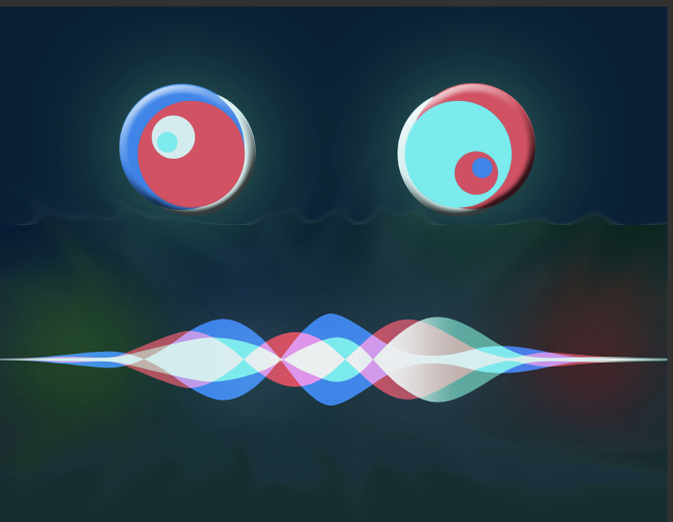
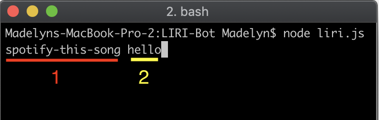
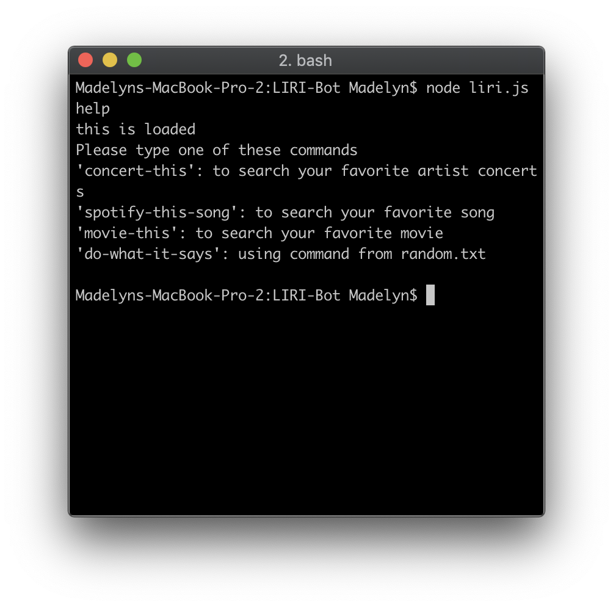
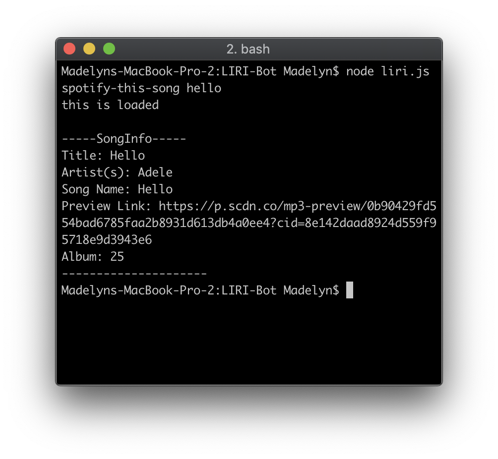
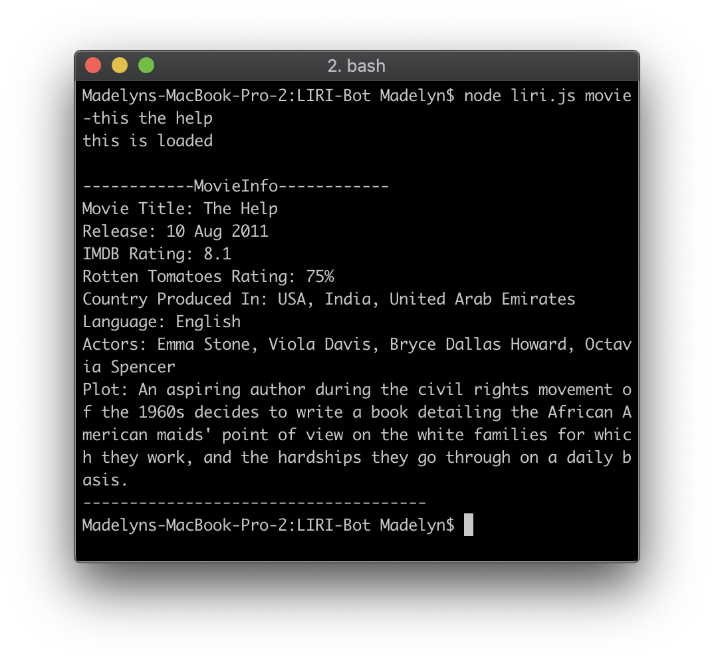
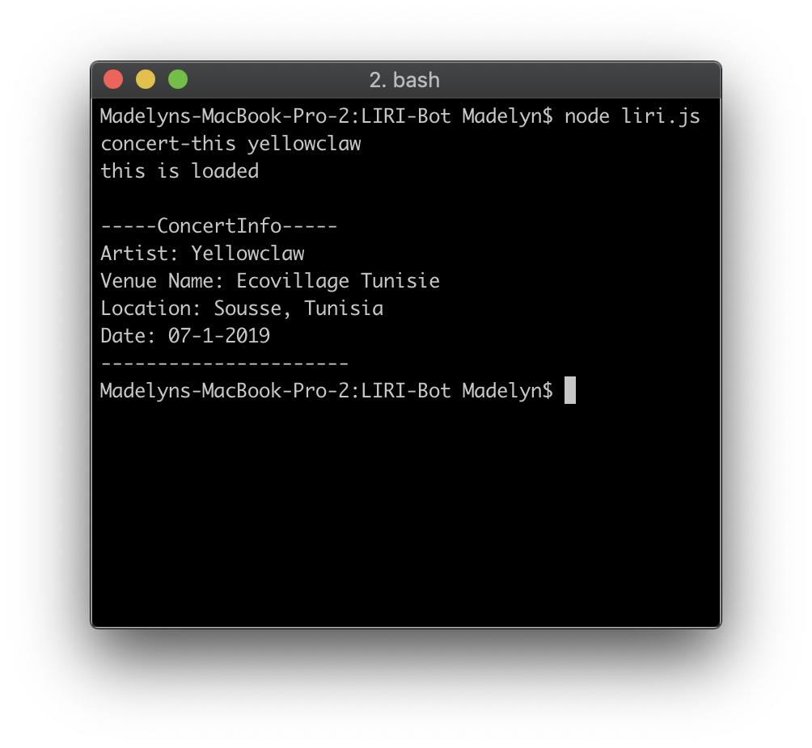
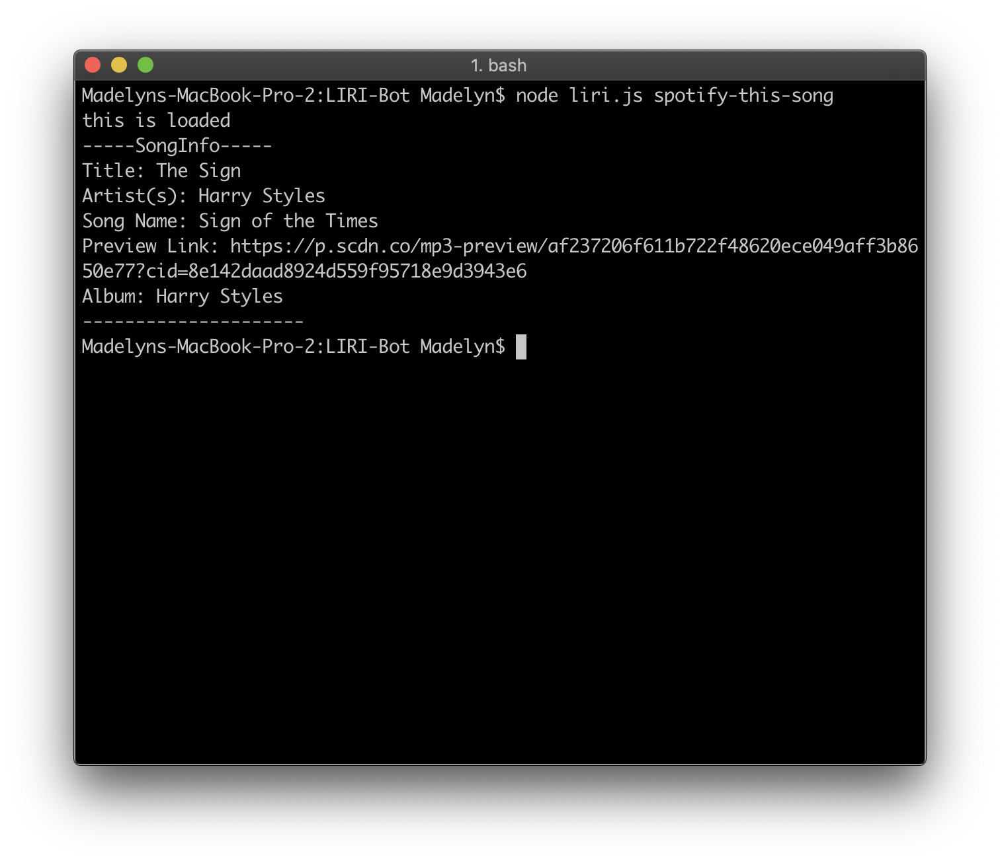

<div style="text-align:center"><h1>LIRI-Node-App</h1><hr></div>

## Table of Contents 
- [Table of Contents](#table-of-contents)
- [What is Liri-Bot?](#what-is-liri-bot)
- [Instructions for how to develop, use, and test the code](#instructions-for-how-to-develop-use-and-test-the-code)
- [Technologies Used](#technologies-used)

<br>

  <div style="text-align:center"></div>

## What is Liri-Bot?

 LIRI stands for: _**L**anguage **I**nterpretation and **R**ecognition **I**nterface._ 
 This is a server-side application, written with node.js, that requires 1-2 arguments.

 <br>
  <div style="text-align:center"></div>
<br>


 ## How does it work?

 * The application is run on the computers command line interface. 
 * The first argument given determines which API function will be ran. 

   * Arguments Allowed:
     * *spotify-this-song*
     * *concert-this*
     * *movie-this*
     * *do-what-it-says*
  
  * If the argument that is given doesn't equal one of those listed above then Liri will prompt the user:

       ```
       LIRI doesn't understand that - Please type 'node liri.js help' for more information
       ```

      * The help argument will return this guide:
  
  <div style="text-align:center"></div>


 * The second argument is the term that will be searched in the API call. After the API call a string of information about the song/band/movie will be `console.log()` to the command line and written to a text file called [log.txt](./assets/log.txt).

    * Examples of the application response:

<hr>

<div style="text-align: center">
  
  
  
</div>
<hr>


### spotify-this-song error


### movie-this error


## Instructions for how to develop, use, and test the code


## Technologies Used

 - Axios
 - JavaScript w/ Node.js 


